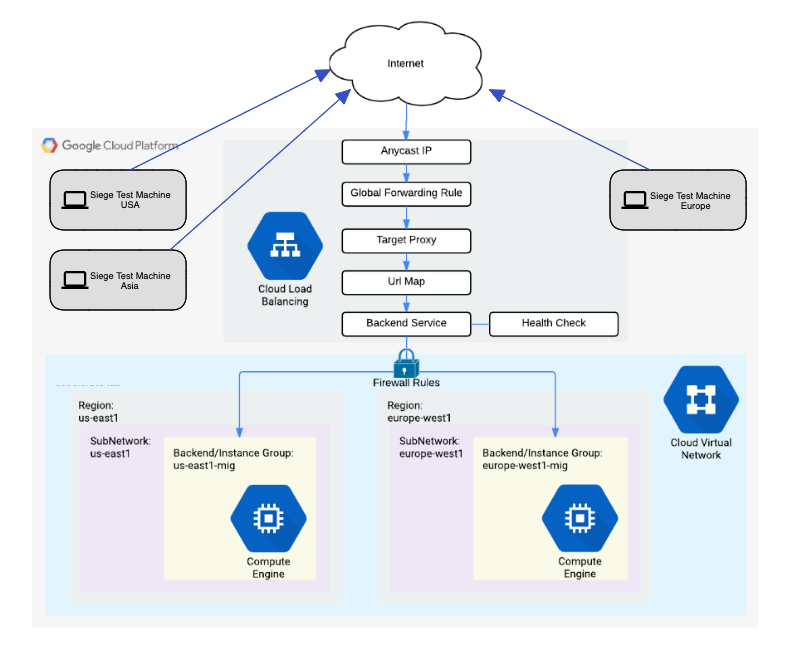
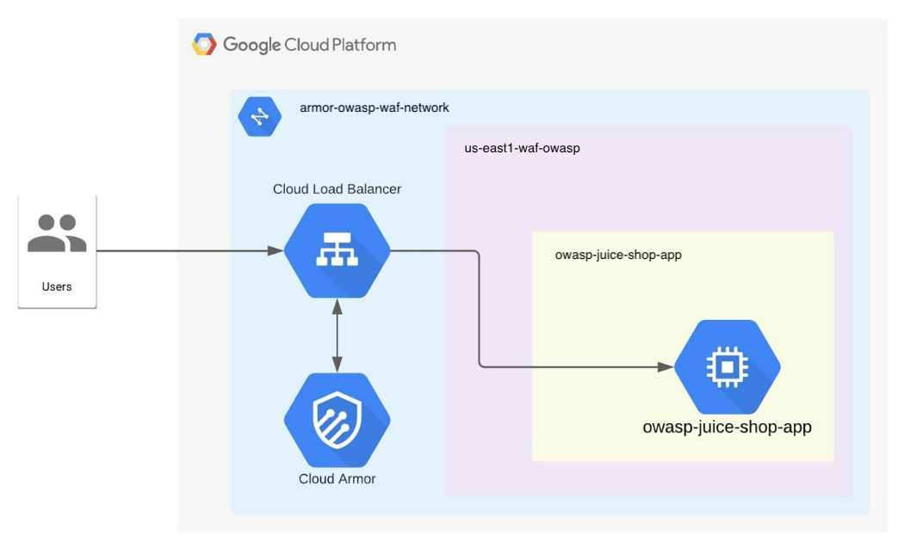

# Demo Guide
This demo uses terraform to setup Cloud Armor in a project and underlying infrastructure to simulate DDoS and Owasp web application attacks by Cloud Armor using Google Cloud Services like [Cloud Armor](https://cloud.google.com/armor), [Cloud Compute Engine](https://cloud.google.com/compute) and [Cloud Logging](https://cloud.google.com/logging).


## Demo-1 Architecture Diagram
The image below describes the architecture of Cloud Armor demo to protect against DDoS attack.



## Demo-2 Architecture Diagram
The image below describes the architecture of Cloud Armor demo to protect against Owasp web application attack. 




## What resources are created?
Main resources:Demo-1
- Cloud Armor security policy (rate-limiting)
- Load-balancer with backend service and health check
- Two backend compute instance groups in two regions
- Three compute instance for test rate in three regions

Main resources:Demo-2
- Cloud Armor security policy (Owasp-web-application)
- Load-balancer with one backend service 
- One backend compute instance group in one region to host owasp-juice-shop-app


## How to deploy?
The following steps should be executed in Cloud Shell in the Google Cloud Console. 

### 1. Create a project and enable billing
Follow the steps in [this guide](https://cloud.google.com/resource-manager/docs/creating-managing-projects).

### 2. Get the code
Clone this github repository go to the root of the repository.

``` 
git clone http://github.com/GoogleCloudPlatform/cloud-armor-demo
cd cloud-armor-demo
```

### 3. Deploy the infrastructure using Terraform

This terraform deployment requires the following variables. 

- demo_project_id       = "YOUR_PROJECT_ID"
- vpc_network_name    = "demo-vpc"
- base_network_region = "us-east1"
- base_network_zone   = "us-east1-c"
- network_region_a    = "europe-west1"
- network_zone_a      = "europe-west1-c"
- network_region_b    = "asia-east1"
- network_zone_b      = "asia-east1-c"

From the root folder of this repo, run the following commands:

```
export TF_VAR_demo_project_id=[YOUR_PROJECT_ID]
terraform init
terraform apply -auto-approve
```

**Note:** Network Region and Zone variables are give a default value. If you wish to deploy the resources in a different regions or zones, update the corresponding variables in variable.tf file.

### 4. Take note of Terraform Outputs

Once terraform finishes provisioning all resources, you will see its outputs. Please take note of outputs, it can be used to simulate manual attacks.
- Navigate to `Cloud Console >> Network Security >> Cloud Armor` to see the configured cloud armor security policy.

- Navigate to `Cloud Console >> Network Services >> Load balancing` to see the two load balancers configured.

- Navigate to `Cloud Console >> Compute Engine >> VM Instances` to see the compute instances created for the two demos.


## How to clean-up?

From the root folder of this repo, run the following command:
```
terraform destroy
```


